# 🚀 Deploy WordPress on Ubuntu EC2


<a href="https://img.shields.io/badge/AWS-EC2-orange"></a>
  <a href="https://img.shields.io/badge/Linux-Ubuntu-blue"></a>
  <a href="https://img.shields.io/badge/CMS-WordPress-blueviolet"></a>
 
> **Goal:** Spin up a fully-functional WordPress site in AWS, learn core cloud skills, and showcase a production-ready deployment.

---

## 🛠️ Tech Stack & Tools

| Layer        | Service / Package            |
|--------------|------------------------------|
| **Compute**  | AWS EC2 (Ubuntu 22.04 LTS)   |
| **Network**  | VPC, Security Groups         |
| **SSH**      | OpenSSH key-pair auth        |
| **Web**      | Apache 2.4                   |
| **Database** | MySQL 8                      |
| **Runtime**  | PHP 8.x + extensions (curl, gd, mbstring, xml, zip) |
| **App**      | WordPress 6.x                |

---

## Architecture

```mermaid
flowchart TD
    Client[User Browser] -->|HTTP 80| ALB{{Application Load Balancer}}
    ALB --> EC2[Ubuntu EC2 Auto-Scaling Group]
    EC2 -->|PHP ↔ MySQL| RDS[(Amazon RDS MySQL)]
    EC2 -- SSH 22 --> Bastion[Jump Host]
    subgraph VPC
      ALB & EC2 & RDS & Bastion
    end
```


---

## Skills Demonstrated
- **Cloud Provisioning:** Launching and configuring AWS EC2 instances
- **Linux Administration:** Package management (`apt`), service management (`systemctl`), file-system permissions
- **Networking & Security:** Configuring Security Groups, SSH key-based access
- **LAMP Stack Setup:** Installing and configuring Apache, MySQL, PHP
- **Application Configuration:** Editing configuration files, enabling PHP modules
- **Troubleshooting:** Debugging service errors, securing credentials

## Implementation Steps
1. **Provision EC2 Instance**: Launched Ubuntu 22.04 LTS t2.micro with key pair and Security Group (SSH, HTTP).
2. **SSH into the Server**:
   ```bash
   chmod 400 ~/your-key.pem
   ssh -i ~/your-key.pem ubuntu@<EC2-PUBLIC-IP>
   ```
3. **System Update & Firewall**:
   ```bash
   sudo apt update && sudo apt upgrade -y
   sudo ufw allow 'Apache Full'
   sudo ufw enable
   ```
4. **Install Apache & PHP**:
   ```bash
   sudo apt install -y apache2 php libapache2-mod-php php-mysql
   sudo systemctl enable --now apache2
   ```
5. **Install & Secure MySQL**:
   ```bash
   sudo apt install -y mysql-server
   sudo mysql_secure_installation
   ```
6. **Create Database & User**:
   ```sql
   sudo mysql -u root -p
   CREATE DATABASE wpdb;
   CREATE USER 'wpuser'@'localhost' IDENTIFIED BY 'StrongPass!';
   GRANT ALL ON wpdb.* TO 'wpuser'@'localhost';
   FLUSH PRIVILEGES; EXIT;
   ```
7. **Download & Extract WordPress**:
   ```bash
   cd /var/www/html
   sudo rm index.html
   sudo wget https://wordpress.org/latest.tar.gz
   sudo tar -xzf latest.tar.gz --strip-components=1
   sudo cp wp-config-sample.php wp-config.php
   ```
8. **Configure WordPress**:
   ```bash
   sudo nano wp-config.php
   # Update DB_NAME, DB_USER, DB_PASSWORD, DB_HOST
   sudo chown -R www-data:www-data /var/www/html
   ```
9. **Enable PHP Extensions**:
   ```bash
   sudo apt install -y php-curl php-gd php-mbstring php-xml php-zip
   sudo systemctl restart apache2
   ```
10. **Verify & Complete Installer**:
    - Navigate to `http://<EC2-PUBLIC-IP>/` and complete the setup wizard.

## Lessons Learned
- **Key-pair Management:** Correct file permissions (`chmod 400`) are crucial for SSH authentication.
- **Service Hardening:** `mysql_secure_installation` reinforced database security best practices.
- **Debug Workflow:** Enabling WordPress debug mode and checking Apache logs enhanced my troubleshooting skills.

## Challenges & Resolutions

- **500 Internal Server Error:** Initially encountered a blank page due to missing PHP extensions (`php-curl`, `php-gd`, etc.) and incorrect file ownership. Resolved by installing required PHP modules and fixing `www-data` user permissions.

- **Database Connection Error:** Saw “Access denied for user 'wpuser'@'localhost'” then “Unknown database 'wpdb'.” Fixed by creating the `wpdb` database, resetting grants for `wpuser`, and flushing privileges so WordPress could connect.

- **Shared Folder Mounting for Key Pair:** Attempted to mount a macOS SMB share to retrieve the SSH key, but received `Permission denied` and could not `chmod` on a CIFS volume. Solved by copying `your-key.pem` to the local filesystem (outside the share) where `chmod 400` worked, then successfully SSHing into the EC2 instance. Alternatively, remounted the share with `file_mode=0600` and `vers=3.0` to allow proper key permissions.

- **SSH Authentication Failures:** After key retrieval, SSH still failed due to overly permissive permissions on the private key (`0555`). Addressed by ensuring the key file had `-r--------` (chmod 400) and verifying the correct login user (`ubuntu@...`).

## End Result
A fully functional WordPress site running on a secured Ubuntu EC2 instance, accessible over HTTP, with a dedicated MySQL back end and firewall rules in place. This project highlights I took away were: provisioning infrastructure, configuring services, and securing applications. 
