# 🚀 Deploy WordPress on Ubuntu EC2

  
  

> **Role:** Junior Cloud Engineer  
> **Goal:** Spin up a fully-functional WordPress site in AWS, learn core cloud skills, and showcase a production-ready deployment.

---

## 🛠️ Tech Stack & Tools

| Layer        | Service / Package            |
|--------------|------------------------------|
| **Compute**  | AWS EC2 (Ubuntu 22.04 LTS)   |
| **Network**  | VPC, Security Groups         |
| **SSH**      | OpenSSH key-pair auth        |
| **Web**      | Apache 2.4                   |
| **Database** | MySQL 8                      |
| **Runtime**  | PHP 8.x + extensions (curl, gd, mbstring, xml, zip) |
| **App**      | WordPress 6.x                |

---

## 📈 Architecture

```mermaid
flowchart TD
    Client[User Browser] -->|HTTP 80| ALB{{Application Load Balancer}}
    ALB --> EC2[Ubuntu EC2 Auto-Scaling Group]
    EC2 -->|PHP ↔ MySQL| RDS[(Amazon RDS MySQL)]
    EC2 -- SSH 22 --> Bastion[Jump Host]
    subgraph VPC
      ALB & EC2 & RDS & Bastion
    end
```

